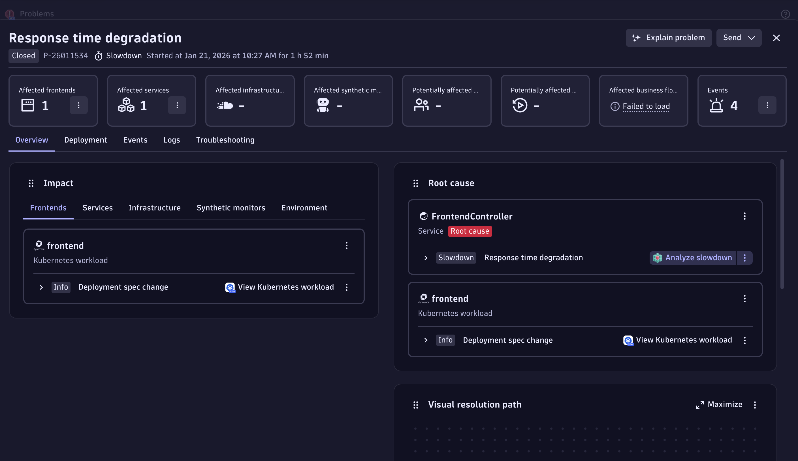

# Fabrik Demo - Iteration Log

This document tracks our journey iterating on the Fabrik demo application to optimize how it appears in Dynatrace. It serves as:
- A reference for the current app state and observability points
- A log of experiments and their outcomes
- A collection of product feedback and feature gaps discovered

---

## Current Application Architecture

### Overview
Fabrik is a microservices demo simulating an e-commerce order flow with chaos engineering for generating realistic problems.

```
┌──────────┐     ┌──────────┐     ┌───────────────┐
│fab-proxy │────▶│ frontend │────▶│    orders     │
│(traffic) │HTTP │  :8080   │REST │    :8080      │
└──────────┘     └──────────┘     └───────┬───────┘
                                          │ Kafka
                      ┌───────────────────┼───────────────────┐
                      ▼                   ▼                   │
              ┌─────────────┐     ┌─────────────┐            │
              │ fulfillment │     │  inventory  │            │
              │   (fraud)   │     │  (stock)    │────────────┤
              └─────────────┘     └─────────────┘            │
                                          │ Kafka            │
                                          ▼                  │
                                  ┌───────────────┐          │
                                  │shipping-recv  │          │
                                  └───────┬───────┘          │
                                          │ REST             │
                                          ▼                  │
                                  ┌───────────────┐          │
                                  │shipping-proc  │          │
                                  │    :8080      │          │
                                  └───────────────┘          │
                                                             │
                      ┌──────────────────────────────────────┘
                      ▼
              ┌─────────────┐     ┌─────────────┐
              │  postgres   │     │    kafka    │
              │   :5432     │     │    :9092    │
              └─────────────┘     └─────────────┘
```

### Deployments
| Namespace | Instrumentation | Purpose |
|-----------|-----------------|---------|
| `fabrik-ot` | OpenTelemetry Java Agent | OTel-based tracing to Dynatrace |
| `fabrik-oa` | OneAgent (auto-injected) | Native Dynatrace instrumentation |

---

## Key Source Code References

### 1. REST Endpoints (Service Entry Points)

| Service | File | Entry Point |
|---------|------|-------------|
| orders | [`apps/orders/src/main/java/com/fabrik/orders/OrderController.java`](apps/orders/src/main/java/com/fabrik/orders/OrderController.java) | `POST /api/orders` |
| shipping-processor | [`apps/shipping-processor/src/main/java/com/fabrik/shipping/processor/ShippingController.java`](apps/shipping-processor/src/main/java/com/fabrik/shipping/processor/ShippingController.java) | `POST /api/shipments` |
| frontend | [`apps/frontend/src/main/java/com/fabrik/frontend/FrontendController.java`](apps/frontend/src/main/java/com/fabrik/frontend/FrontendController.java) | `GET /`, `POST /order` |

### 2. Database Interactions (JDBC/JPA)

| Service | Repository | Entity |
|---------|------------|--------|
| orders | [`OrderRepository.java`](apps/orders/src/main/java/com/fabrik/orders/OrderRepository.java) | `OrderEntity` |
| shipping-processor | [`ShipmentRepository.java`](apps/shipping-processor/src/main/java/com/fabrik/shipping/processor/ShipmentRepository.java) | `Shipment` |
| frontend | [`OrderRepository.java`](apps/frontend/src/main/java/com/fabrik/frontend/OrderRepository.java) | `OrderEntity` |
| fulfillment | [`FraudCheckRepository.java`](apps/fulfillment/src/main/java/com/fabrik/fulfillment/FraudCheckRepository.java) | `FraudCheck` |
| inventory | [`InventoryRepository.java`](apps/inventory/src/main/java/com/fabrik/inventory/InventoryRepository.java) | `InventoryItem` |

**DB Slowdown Simulation** (for generating Database problems):
- Location: [`OrderController.java:47-69`](apps/orders/src/main/java/com/fabrik/orders/OrderController.java#L47-L69)
- Location: [`ShippingController.java:44-62`](apps/shipping-processor/src/main/java/com/fabrik/shipping/processor/ShippingController.java#L44-L62)
- Trigger: `DB_SLOWDOWN_RATE` and `DB_SLOWDOWN_DELAY` env vars
- Method: Heavy PostgreSQL computation query

### 3. Kafka Messaging

| Service | Role | Topic | Code |
|---------|------|-------|------|
| orders | Producer | `orders` | [`KafkaProducerService.java`](apps/orders/src/main/java/com/fabrik/orders/KafkaProducerService.java) |
| fulfillment | Consumer | `orders` | [`FulfillmentService.java`](apps/fulfillment/src/main/java/com/fabrik/fulfillment/FulfillmentService.java) |
| inventory | Consumer/Producer | `orders` → `inventory-reserved` | [`InventoryService.java`](apps/inventory/src/main/java/com/fabrik/inventory/InventoryService.java) |
| shipping-receiver | Consumer | `inventory-reserved` | [`ShippingReceiverService.java`](apps/shipping-receiver/src/main/java/com/fabrik/shipping/receiver/ShippingReceiverService.java) |

**Message Slowdown Simulation**:
- Location: [`ShippingReceiverService.java:32-56`](apps/shipping-receiver/src/main/java/com/fabrik/shipping/receiver/ShippingReceiverService.java#L32-L56)
- Trigger: `MSG_SLOWDOWN_RATE` and `MSG_SLOWDOWN_DELAY` env vars

### 4. Failure Injection Points

| Service | Failure Type | Code Location |
|---------|--------------|---------------|
| orders | QueryTimeoutException | [`OrderController.java:31-49`](apps/orders/src/main/java/com/fabrik/orders/OrderController.java#L31-L49) |
| shipping-processor | QueryTimeoutException | [`ShippingController.java:26-42`](apps/shipping-processor/src/main/java/com/fabrik/shipping/processor/ShippingController.java#L26-L42) |
| shipping-receiver | Message processing failure | [`ShippingReceiverService.java:64-97`](apps/shipping-receiver/src/main/java/com/fabrik/shipping/receiver/ShippingReceiverService.java#L64-L97) |

Controlled via: `FAILURE_MODE=true` or `FAILURE_RATE=<percentage>`

---

## What We Want to See in Dynatrace

### Services App
- [ ] Clear service topology showing the full request flow
- [ ] Proper service naming (not generic "Java" services)
- [ ] Database calls attributed correctly
- [ ] Kafka messaging relationships visible

### Traces
- [ ] End-to-end distributed traces from frontend → shipping-processor
- [ ] Database spans with query details
- [ ] Kafka produce/consume spans linked
- [ ] Proper span naming and attributes

### Problems
- [ ] Database slowdowns detected as problems
- [ ] Error rate increases detected
- [ ] Service degradation alerts

### Logs
- [ ] Logs correlated with traces
- [ ] Log-based problem detection
- [ ] Structured log attributes visible

---

## Experiment Log

### Experiment 1: 2026-01-21 - Response Time Degradation Investigation

**Goal**: Investigate a response time degradation problem detected by Davis AI on the FrontendController service.

**Context**: After deploying the REST-based services (converted from gRPC), Davis detected a slowdown problem affecting the frontend service.

**Flow**:
1. Started at the **Problems screen** showing 10 problems including response time degradations and failure rate increases
2. Clicked into problem **P-26011534** - "Response time degradation" for FrontendController
3. Davis identified the root cause and showed "Analyze slowdown" option
4. Clicked "Analyze slowdown" which navigated to the **Response Time** analysis screen
5. Response Time screen showed hotspots:
   - `placeOrder`: 905.27ms (+896.44ms increase from baseline)
   - `getOrders`: 14.02ms (-995.00ms, actually improved)
6. Wanted to investigate failures, so navigated to **Failures** tab
7. **Found a bug**: The Failures chart showed 0 failures, but the table below showed 78 failed requests

**Screenshots**:
- 
- 
- 
- 

**Links**:
- [Problem P-26011534](https://abl46885.dev.apps.dynatracelabs.com/ui/apps/dynatrace.davis.problems/problem/-7984242418976461431_1768987320000V2)
- [Response Time Analysis](https://abl46885.dev.apps.dynatracelabs.com/ui/apps/dynatrace.services/response-time?tf=2026-01-21T09%3A05%3A24.903Z%3B2026-01-21T11%3A34%3A00.000Z&filter=dt.entity.service+%3D+SERVICE-DBDE40AA90378BA2&problemId=-7984242418976461431_1768987320000V2&compare=true)
- [Failures Analysis (buggy)](https://abl46885.dev.apps.dynatracelabs.com/ui/apps/dynatrace.services/failure-analysis?tf=2026-01-21T09%3A05%3A24.903Z%3B2026-01-21T11%3A25%3A34.694Z&filter=request.status_code+%3D+Failure+AND+dt.entity.service+%3D+SERVICE-DBDE40AA90378BA2&faTabId=exceptions)

**Verdict**: The workflow from Problem → Analyze slowdown → Response Time works well. However, the Failures tab has a significant visualization bug (see Product Feedback below).

---

## Product Feedback & Issues

### Gaps Discovered

| Category | Issue | Severity | Notes |
|----------|-------|----------|-------|
| Services App - Failures | **Failures chart shows 0 when table shows 78 failures** | High | Chart visualization doesn't match table data. See [Failures Analysis link](https://abl46885.dev.apps.dynatracelabs.com/ui/apps/dynatrace.services/failure-analysis?tf=2026-01-21T09%3A05%3A24.903Z%3B2026-01-21T11%3A25%3A34.694Z&filter=request.status_code+%3D+Failure+AND+dt.entity.service+%3D+SERVICE-DBDE40AA90378BA2&faTabId=exceptions) and screenshot `screen-shots/4-makes-nosense-why-no-failures.png` |

### Bug Details: Failures Chart Visualization

**Issue**: On the Failures tab in the Services app, the chart displays a flat line at 0 failures, but the table below clearly shows:
- `placeOrder`: 77 failed requests (`jakarta.servlet.ServletException`)
- `getOrders`: 1 failed request (`jakarta.servlet.ServletException`)
- **Total: 78 failures**

**Expected**: The chart should visualize the same 78 failures that appear in the table.

**Observed**: Chart shows 0/min across the entire time range.

**Screenshot**: 

**Possible causes**:
1. Time aggregation mismatch between chart and table
2. Chart rendering bug - data exists but isn't drawn
3. Y-axis scaling issue (shows "150 min" which seems wrong for failure counts)

### Feature Requests

| Feature | Use Case | Priority |
|---------|----------|----------|
| | | |

### Documentation Gaps

| Topic | What's Missing |
|-------|----------------|
| | |

---

## Demo Flow (Draft)

*To be developed as we iterate*

### Story Arc
1. **Introduction**: Show healthy application flow
2. **Problem Detection**: Trigger chaos, show Davis AI detection
3. **Root Cause Analysis**: Drill into traces, logs, database calls
4. **Resolution**: Show how Dynatrace pinpoints the issue

### Key Screens to Showcase
- [ ] Services app topology
- [ ] Distributed traces
- [ ] Database analysis
- [ ] Log viewer with trace correlation
- [ ] Problems screen with Davis AI

---

## Changelog

| Date | Change | Commit |
|------|--------|--------|
| 2025-01-21 | Initial setup - converted gRPC to REST for OneAgent compatibility | pending |
| 2025-01-21 | Removed fabrik-oa-2 namespace, downsized nodes to e2-standard-4 | N/A (infra) |
