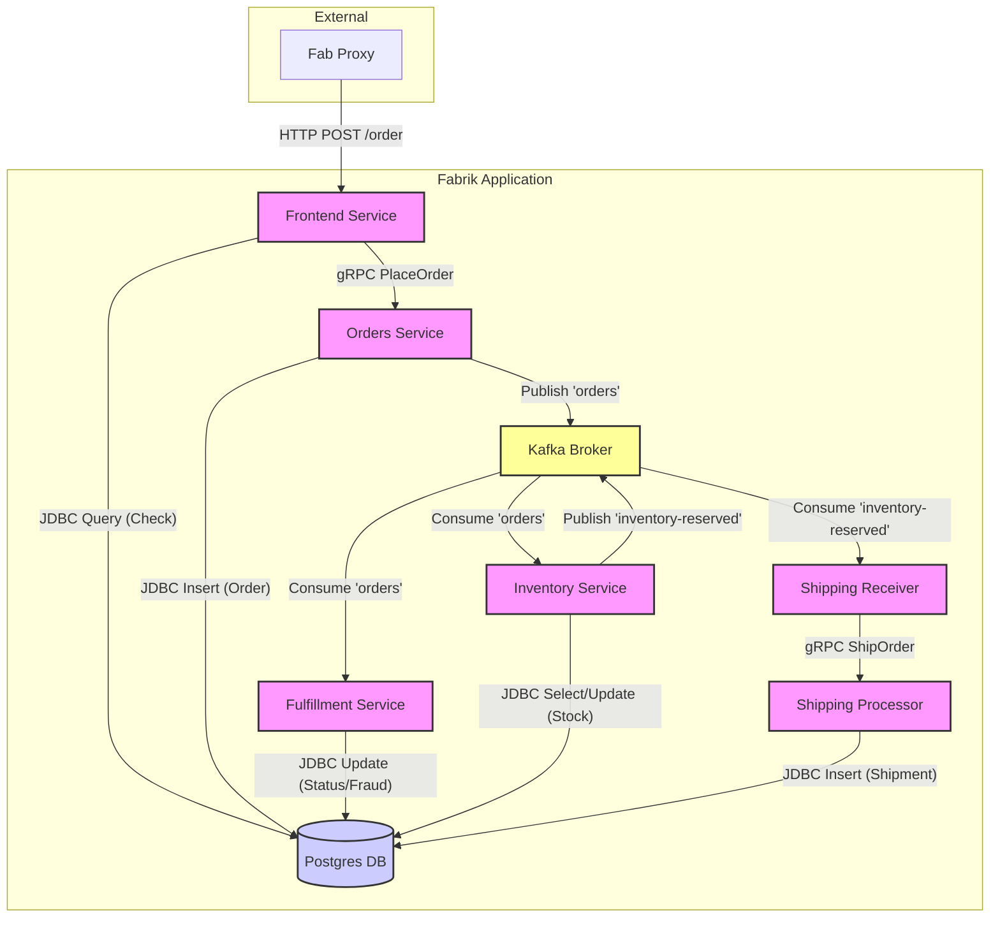

# Fabrik II Demo

## Architecture


```mermaid
flowchart TD
    subgraph "External"
        LG[Fab Proxy]
    end

    subgraph "Fabrik Application"
        FE[Frontend Service]
        OS[Orders Service]
        FS[Fulfillment Service]
        IS[Inventory Service]
        SR[Shipping Receiver]
        SP[Shipping Processor]
        
        DB[(Postgres DB)]
        K[Kafka Broker]
    end

    %% Load Generation
    LG -- "HTTP POST /order" --> FE

    %% Frontend Flow
    FE -- "JDBC Query (Check)" --> DB
    FE -- "gRPC PlaceOrder" --> OS

    %% Orders Flow
    OS -- "JDBC Insert (Order)" --> DB
    OS -- "Publish 'orders'" --> K

    %% Fulfillment Flow (Async)
    K -- "Consume 'orders'" --> FS
    FS -- "JDBC Update (Status/Fraud)" --> DB

    %% Inventory Flow (Async)
    K -- "Consume 'orders'" --> IS
    IS -- "JDBC Select/Update (Stock)" --> DB
    IS -- "Publish 'inventory-reserved'" --> K

    %% Shipping Flow (Async + Sync)
    K -- "Consume 'inventory-reserved'" --> SR
    SR -- "gRPC ShipOrder" --> SP
    SP -- "JDBC Insert (Shipment)" --> DB

    %% Styling
    classDef service fill:#f9f,stroke:#333,stroke-width:2px;
    classDef db fill:#ccf,stroke:#333,stroke-width:2px;
    classDef queue fill:#ff9,stroke:#333,stroke-width:2px;
    
    class FE,OS,FS,IS,SR,SP service;
    class DB db;
    class K queue;
```

## Chaos Simulation

The demo includes a simulated "bad deployment" scenario managed by a fake ArgoCD controller.

**What happens:**
1.  **Deployment Event:** A "Deployment Started" event for version `v2.0.0-bad` is sent to Dynatrace.
2.  **Fault Injection:** The `orders` and `fulfillment` services are patched to introduce a 5-second latency and throw `QueryTimeoutException` (simulating DB lock/timeout issues).
3.  **Duration:** This state lasts for **1 minute**.
4.  **Rollback:** A "Deployment Finished" event for `v2.0.0-bad` is sent, followed by a rollback to `v1.0.0-stable` (clearing the faults).

**How to trigger:**

*   **Manual:**
    ```bash
    kubectl exec -n default -it deploy/argo -- /app/simulate.sh manual
    ```
*   **Automatic:** The simulation runs automatically at random intervals between 2 and 4 hours.
