# Fabrik II Demo - Comprehensive Chaos Engineering for Dynatrace

A full-stack microservices application designed to demonstrate Dynatrace Davis AI anomaly detection, root cause analysis, and deployment correlation through realistic failure scenarios.

## 🏗️ Architecture

```mermaid
flowchart TD
    subgraph "External Load Generator"
        LG[Fab Proxy]
    end

    subgraph "Fabrik Microservices Platform"
        FE["Frontend Service<br/>🔥 HTTP 500s<br/>⏱️ Slow Responses"]
        OS["Orders Service<br/>🔥 DB Timeouts<br/>⏱️ 5s Delays"]
        FS["Fulfillment Service<br/>🔥 DB Timeouts<br/>⏱️ Query Failures"]
        IS["Inventory Service<br/>🔥 DB Timeouts<br/>♻️ Auto-Replenish"]
        SR["Shipping Receiver<br/>🔥 Message Failures<br/>⏱️ Connection Timeouts"]
        SP["Shipping Processor<br/>🔥 gRPC Failures<br/>🔥 DB Timeouts"]

        DB[(Postgres Database<br/>🎯 Failure Target)]
        K["Kafka Broker<br/>📨 Message Queue"]
    end

    %% Load Generation Flow
    LG -- "🚀 HTTP POST /order<br/>Continuous Load" --> FE

    %% Frontend Flow
    FE -- "📊 JDBC Query (Check Orders)<br/>💥 15% Failure Rate" --> DB
    FE -- "🔗 gRPC PlaceOrder<br/>💥 HTTP 500 Injection" --> OS

    %% Orders Flow
    OS -- "💾 JDBC Insert (New Order)<br/>💥 30% Failure Rate" --> DB
    OS -- "📤 Publish 'orders' Topic<br/>💥 DB Timeout Chain" --> K

    %% Fulfillment Flow (Async)
    K -- "📥 Consume 'orders'<br/>💥 30% Failure Rate" --> FS
    FS -- "📝 JDBC Update (Fraud Check)<br/>💥 Query Timeouts" --> DB

    %% Inventory Flow (Async)
    K -- "📥 Consume 'orders'<br/>💥 25% Failure Rate" --> IS
    IS -- "📦 JDBC Select/Update (Stock)<br/>💥 Slow Lookups" --> DB
    IS -- "📤 Publish 'inventory-reserved'<br/>♻️ Auto-Replenishment" --> K

    %% Shipping Flow (Async + Sync)
    K -- "📥 Consume 'inventory-reserved'<br/>💥 20% Failure Rate" --> SR
    SR -- "🔗 gRPC ShipOrder<br/>💥 Connection Failures" --> SP
    SP -- "💾 JDBC Insert (Shipment)<br/>💥 20% Failure Rate" --> DB

    %% Chaos Indicators
    subgraph "🔥 Chaos Engineering"
        direction TB
        C1["⚡ Random Intervals: 0-2 Hours"]
        C2["💥 Correlated Failures Across Stack"]
        C3["🎯 Multiple Failure Types"]
        C4["📊 Davis AI Anomaly Detection"]
    end

    %% Styling
    classDef service fill:#e1f5fe,stroke:#01579b,stroke-width:2px;
    classDef chaos fill:#ffebee,stroke:#d32f2f,stroke-width:2px;
    classDef db fill:#f3e5f5,stroke:#4a148c,stroke-width:2px;
    classDef queue fill:#fff3e0,stroke:#e65100,stroke-width:2px;

    class FE,OS,FS,IS,SR,SP service;
    class DB db;
    class K queue;
    class C1,C2,C3,C4 chaos;
```



## 🔥 Advanced Chaos Engineering

This demo implements comprehensive chaos engineering to create realistic production-like failures that demonstrate Dynatrace's AI-powered observability capabilities.

### 🎯 **Demo Objectives**
- **Anomaly Detection**: Unpredictable failure patterns that Davis AI can identify as deviations from baseline
- **Root Cause Analysis**: Correlated failures across the microservices stack
- **Deployment Impact**: Clear correlation between deployment events and system degradation
- **End-to-End Visibility**: Full transaction tracing through cascading failures

### ⚡ **Chaos Simulation Features**

#### **1. Unpredictable Timing**
- **Random Intervals**: 0-2 hours between chaos episodes
- **Prevents Baseline Adaptation**: Davis AI doesn't normalize failures as expected behavior
- **Realistic Production Patterns**: Mimics real-world unpredictable outages

#### **2. Multi-Service Failure Injection**

| Service | Failure Rate | Failure Types | Impact |
|---------|-------------|---------------|--------|
| **Orders** | 30% | DB query timeouts, 5s delays | Core transaction blocking |
| **Fulfillment** | 30% | DB connection issues, query failures | Fraud check delays |
| **Inventory** | 25% | Slow lookups, timeout exceptions | Stock check failures |
| **Shipping Receiver** | 20% | Message processing failures | Order fulfillment breaks |
| **Shipping Processor** | 20% | gRPC errors, DB timeouts | Shipment creation fails |
| **Frontend** | 15% | HTTP 500 responses, slow responses | User experience degradation |

#### **3. Realistic Failure Scenarios**

**Database Connection Pool Exhaustion:**
```
🔥 Simulated via query timeouts across all services
📊 Shows cascading database pressure
🎯 Demonstrates infrastructure bottlenecks
```

**End-to-End Transaction Failures:**
```
🚀 Frontend Request → 💥 Orders Timeout → 💥 Inventory Delay → 💥 Shipping Failure
📈 Complete user journey degradation
🔍 Perfect for distributed tracing analysis
```

**Multi-Protocol Communication Failures:**
```
📡 HTTP (Frontend APIs)
🔗 gRPC (Orders ↔ Shipping)
📨 Kafka Messaging (All async flows)
💾 JDBC Database (All services)
```

#### **4. Continuous Operation Features**

**Auto-Inventory Replenishment:**
- Automatically restocks when inventory ≤ 5 items
- Ensures shipping services always have work
- Maintains continuous demo flow

**Deployment Event Correlation:**
- SDLC events mark chaos periods
- Clear deployment→failure correlation
- Enables deployment impact analysis

### 🚀 **Running Chaos Simulations**

#### **Manual Trigger:**
```bash
kubectl exec -n default -it deploy/argo -- /app/simulate.sh manual
```

#### **Automatic Operation:**
The chaos simulation runs continuously with random intervals:
- **Timing**: 0-2 hours between episodes
- **Duration**: 10 minutes of coordinated failures
- **Recovery**: Automatic rollback to stable state

#### **Expected Dynatrace Observations:**

**During Chaos Episodes:**
- 🔺 Response time increases across all services
- 🚨 Error rate spikes (HTTP 500s, DB exceptions)
- 📊 Database query timeout alerts
- 🔗 Broken distributed traces
- 📉 Transaction failure rate increases

**Davis AI Analysis:**
- 🤖 Anomaly detection for performance deviations
- 🎯 Root cause correlation to deployment events
- 🕷️ Service dependency impact mapping
- 📈 Baseline vs. incident performance comparison

### 📊 **Perfect Demo Scenarios**

1. **Deployment Impact Analysis**: Show how "v2.0.0-green" deployment correlates with system degradation
2. **AI-Powered Root Cause**: Davis identifies database timeouts as primary failure cause
3. **Service Dependency Mapping**: Visualize how failures cascade through microservices
4. **Automated Remediation**: Demonstrate rollback to "v1.0.0-blue" restoring system health
5. **Proactive Monitoring**: Alert on performance degradation before complete failure

This comprehensive chaos engineering setup provides rich, realistic data for demonstrating Dynatrace's full observability and AI capabilities in a modern microservices environment.
