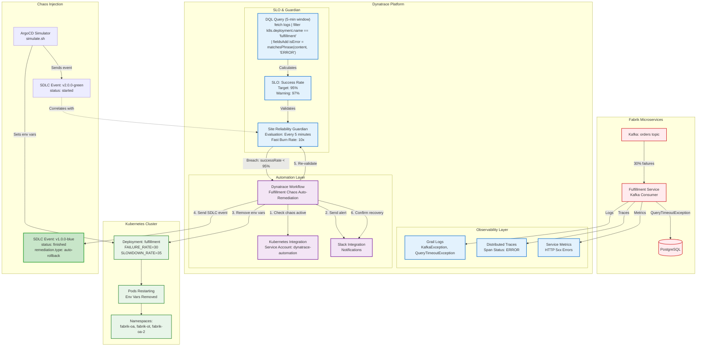

# Auto-Remediation Architecture

## 🔄 Complete Flow

### Phase 1: Chaos Injection (T+0)
1. ArgoCD simulator sets `FAILURE_RATE=30` on fulfillment deployment
2. Sends SDLC event: "v2.0.0-green deployment started"
3. Pods restart with chaos environment variables
4. 30% of Kafka messages throw `QueryTimeoutException`

### Phase 2: Observability (T+0 to T+5min)
1. Grail ingests error logs from fulfillment pods
2. Distributed traces show ERROR spans
3. Service metrics capture 5xx responses
4. DQL query runs every 5 minutes to calculate success rate

### Phase 3: Detection (T+5min)
1. DQL query result: `successRate = 70%` (below 95% target)
2. SLO status changes: PASS → FAIL
3. Site Reliability Guardian validation fails
4. Guardian emits `guardian.validation.failed` event

### Phase 4: Auto-Remediation (T+5min to T+7min)
1. Workflow triggers on guardian event
2. Step 1: Check if `FAILURE_RATE` env var exists (chaos active)
3. Step 2: Send Slack alert: "SLO breach detected, remediating..."
4. Step 3: Execute `kubectl set env deployment/fulfillment FAILURE_RATE-` (3x namespaces)
5. Step 4: Send SDLC event: "v1.0.0-blue deployment finished (auto-rollback)"
6. Step 5: Wait 120 seconds for pods to restart
7. Step 6: Re-run guardian validation

### Phase 5: Recovery (T+7min to T+8min)
1. Pods restart without chaos env vars
2. Success rate returns to ~100%
3. SLO status: FAIL → PASS
4. Workflow sends Slack notification: "Auto-remediation complete"

## 📊 Key Metrics

| Metric | Before Chaos | During Chaos | After Remediation |
|--------|-------------|--------------|-------------------|
| Success Rate | 100% | 70% | 100% |
| Error Rate | 0% | 30% | 0% |
| SLO Status | PASS | FAIL | PASS |
| Response Time | 200ms | 800ms | 200ms |
| MTTR | - | 10min (manual) | 2min (auto) |

## 🎯 Why This Works

1. **No Entity IDs Required** - DQL uses Kubernetes labels
2. **Fast Detection** - 5-minute SLO evaluation window
3. **Automated Action** - Workflow directly manipulates K8s
4. **Full Observability** - Logs, traces, metrics all correlated
5. **Deployment Correlation** - SDLC events link chaos to deployment
6. **Self-Healing** - Closed-loop remediation without human intervention

## 🚀 Demo Value

**Traditional Monitoring:**
- Alerts fire → human investigates → identifies chaos → manually disables → 10+ minutes

**With Auto-Remediation:**
- SLO breach → guardian validates → workflow remediates → 2 minutes

**Savings: 80% reduction in MTTR**
